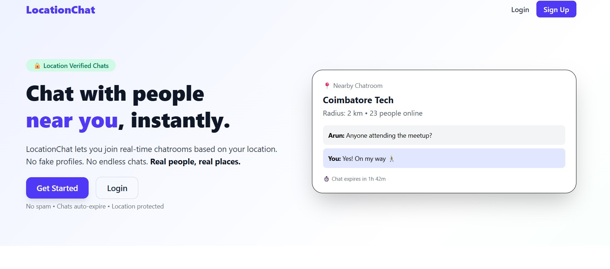
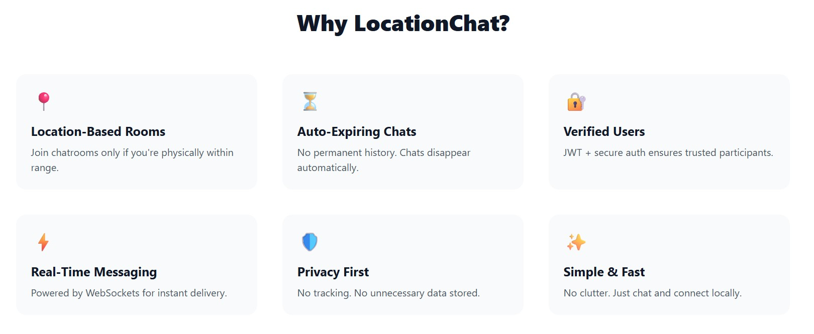
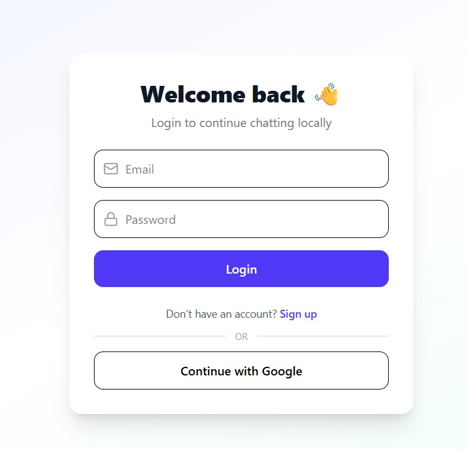
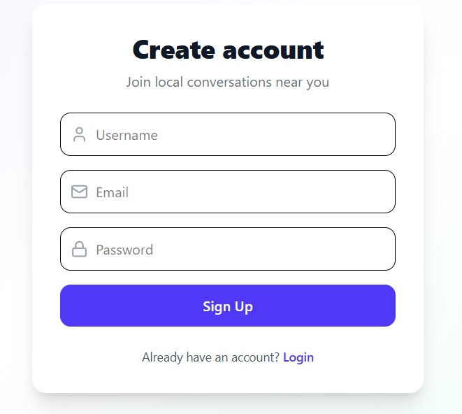
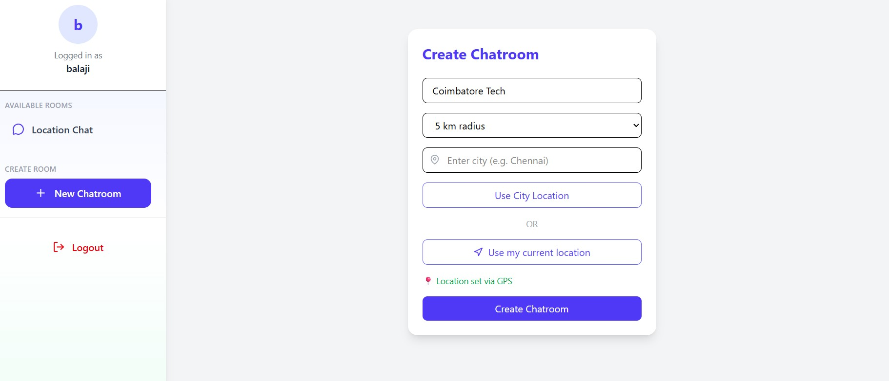
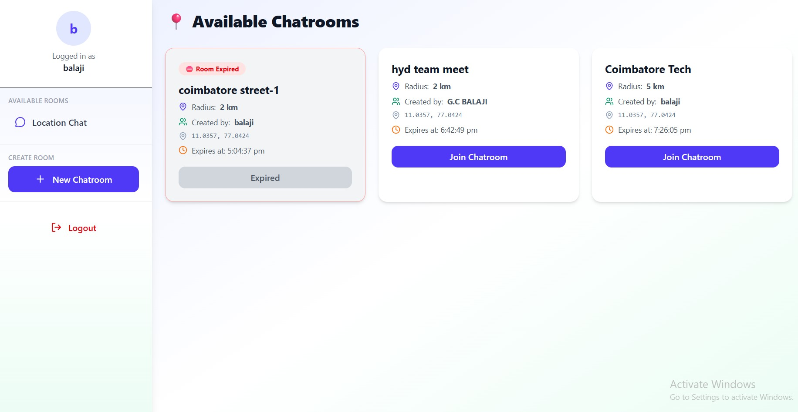
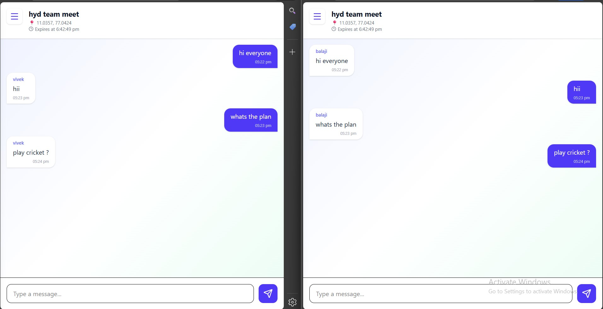
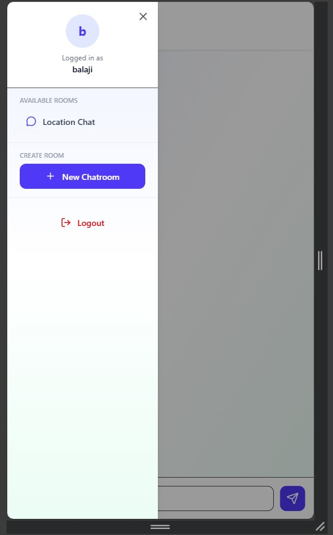

# Location Based Chatroom

A real-time, location-based chat application built with the MERN stack. Users can create and join chatrooms based on geographical locations, enabling localized conversations with nearby participants.

## Features

- **Location-Based Chatrooms**: Create chatrooms tied to specific GPS coordinates with customizable radius
- **Real-Time Messaging**: Instant messaging powered by Socket.io
- **User Authentication**: Support for local registration/login and Google OAuth
- **Geolocation Integration**: Automatic location detection for chatroom discovery
- **Message Expiry**: Messages automatically expire after 2 hours for privacy
- **Responsive Design**: Modern UI built with React and Tailwind CSS
- **Cross-Platform**: Works on desktop and mobile devices

## Tech Stack

### Frontend

- **React 19** - UI framework
- **Vite** - Build tool and dev server
- **Tailwind CSS** - Utility-first CSS framework
- **React Router** - Client-side routing
- **Socket.io Client** - Real-time communication
- **Axios** - HTTP client
- **Framer Motion** - Animations
- **React Hot Toast** - Notifications

### Backend

- **Node.js** - Runtime environment
- **Express.js** - Web framework
- **MongoDB** - NoSQL database
- **Mongoose** - ODM for MongoDB
- **Socket.io** - Real-time bidirectional communication
- **JWT** - JSON Web Tokens for authentication
- **Passport.js** - Authentication middleware
- **bcryptjs** - Password hashing

## Folder Structure

```
chatapplicationAssignment/
├── backend/
│   ├── src/
│   │   ├── config/
│   │   │   ├── db.js
│   │   │   └── passport.js
│   │   ├── controllers/
│   │   │   ├── chatroom.controller.js
│   │   │   ├── message.controller.js
│   │   │   └── user.controller.js
│   │   ├── middlewares/
│   │   │   ├── auth.middleware.js
│   │   │   ├── error.middleware.js
│   │   │   └── location.middleware.js
│   │   ├── models/
│   │   │   ├── chatroom.model.js
│   │   │   ├── message.model.js
│   │   │   └── user.model.js
│   │   ├── routes/
│   │   │   ├── chatroom.routes.js
│   │   │   ├── message.routes.js
│   │   │   └── user.routes.js
│   │   ├── sockets/
│   │   │   ├── auth.socket.middleware.js
│   │   │   └── chat.socket.js
│   │   ├── utils/
│   │   │   ├── distance.js
│   │   │   ├── hash.js
│   │   │   └── jwt.js
│   │   ├── app.js
│   │   └── server.js
│   ├── package.json
│   └── .gitignore
├── frontend/
│   └── LocationChat/
│       ├── src/
│       │   ├── api/
│       │   │   ├── auth.api.js
│       │   │   ├── chatromm.api.js
│       │   │   ├── message.api.js
│       │   ├── assets/
│       │   ├── components/
│       │   │   └── ...
│       │   ├── pages/
│       │   │   └── ...
│       │   ├── socket/
│       │   ├── utlis/
│       │   ├── App.jsx
│       │   ├── main.jsx
│       │   └── index.css
│       ├── public/
│       ├── package.json
│       ├── vite.config.js
│       └── index.html
├── .gitignore
└── README.md
```

## Installation

### Prerequisites

- Node.js (v16 or higher)
- MongoDB (local or cloud instance)
- Google OAuth credentials (for Google login)

### Backend Setup

1. Navigate to the backend directory:

   ```bash
   cd backend
   ```

2. Install dependencies:

   ```bash
   npm install
   ```

3. Create a `.env` file in the backend directory with the following variables:

   ```env
   MONGO_URI=mongodb://localhost:27017/locationchat
   JWT_SECRET=your_jwt_secret_key_here
   GOOGLE_CLIENT_ID=your_google_client_id
   GOOGLE_CLIENT_SECRET=your_google_client_secret
   GOOGLE_CALLBACK_URL=http://localhost:5000/api/auth/google/callback
   ```

4. Start the backend server:
   ```bash
   npm start
   ```
   The server will run on http://localhost:5000

### Frontend Setup

1. Navigate to the frontend directory:

   ```bash
   cd frontend/LocationChat
   ```

2. Install dependencies:

   ```bash
   npm install
   ```

3. Start the development server:
   ```bash
   npm run dev
   ```
   The frontend will run on http://localhost:5173

## Environment Variables

### Backend (.env)

- `MONGO_URI`: MongoDB connection string
- `JWT_SECRET`: Secret key for JWT token generation
- `GOOGLE_CLIENT_ID`: Google OAuth client ID
- `GOOGLE_CLIENT_SECRET`: Google OAuth client secret
- `GOOGLE_CALLBACK_URL`: Google OAuth callback URL

## How to Run the Project

1. **Start MongoDB**: Ensure MongoDB is running on your system
2. **Start Backend**: `cd backend && npm start`
3. **Start Frontend**: `cd frontend/LocationChat && npm run dev`
4. **Access Application**: Open http://localhost:5173 in your browser

The application will automatically connect to the backend API and establish Socket.io connections for real-time messaging.

## API Overview

### Authentication Endpoints

- `POST /api/auth/register` - User registration
- `POST /api/auth/login` - User login
- `GET /api/auth/google` - Google OAuth login
- `GET /api/auth/google/callback` - Google OAuth callback

### Chatroom Endpoints

- `GET /api/chatrooms` - Get all accessible chatrooms (based on location)
- `POST /api/chatrooms` - Create a new chatroom
- `GET /api/chatrooms/:id` - Get chatroom details

### Message Endpoints

- `GET /api/messages/:chatroomId` - Get messages for a chatroom
- `POST /api/messages` - Send a new message

### Real-Time Events (Socket.io)

- `join-room`: Join a chatroom
- `send-message`: Send a message to a chatroom
- `receive-message`: Receive messages in real-time
- `leave-room`: Leave a chatroom

## JWT Authentication Flow

The application uses JSON Web Tokens (JWT) for secure authentication and authorization. Here's how the authentication flow works:

### Local Authentication

1. **Registration/Login**: User submits credentials (email, password, username for registration)
2. **Password Hashing**: Passwords are hashed using bcryptjs before storage
3. **Token Generation**: Upon successful authentication, a JWT is generated with user ID payload
4. **Token Storage**: JWT is stored in localStorage on the client side
5. **API Authorization**: Subsequent API requests include `Authorization: Bearer <token>` header
6. **Token Verification**: Server verifies JWT using the secret key and attaches user data to request

### Google OAuth Flow

1. **OAuth Initiation**: User clicks "Continue with Google" button
2. **Redirect to Google**: User is redirected to Google's OAuth consent screen
3. **Authorization Code**: Google redirects back with authorization code
4. **Token Exchange**: Backend exchanges code for user profile information
5. **User Creation/Login**: System creates new user or finds existing user by email
6. **JWT Generation**: JWT token is generated and sent to frontend via redirect URL
7. **Auto Login**: Frontend receives token and automatically logs in the user

### Socket Authentication

- WebSocket connections require JWT token in handshake authentication
- Server validates token and attaches user data to socket instance
- All real-time events are authenticated and user-scoped

### Security Features

- Tokens expire after 7 days for local auth
- Passwords are never stored in plain text
- HTTPS recommended for production deployment
- CORS configured for secure cross-origin requests

## Socket.IO Real-Time Chat Explanation

The application leverages Socket.IO for instant, bidirectional communication enabling real-time chat functionality:

### Connection Establishment

1. **Client Connection**: Frontend connects to Socket.IO server with JWT token
2. **Authentication**: Server validates JWT and attaches user data to socket
3. **Room Management**: Users can join/leave chatrooms dynamically

### Chatroom Lifecycle

1. **Room Creation**: Chatrooms are created with geographic coordinates and radius
2. **Time-Limited Chats**: Each chatroom expires after 2 hours from creation
3. **Geographic Filtering**: Users only see chatrooms within their location radius

### Message Flow

```
User A Types Message → Client emits 'sendMessage' → Server validates → Saves to DB → Broadcasts 'newMessage' → All room members receive update
```

### Key Events

- **`joinRoom`**: User joins a chatroom, receives room info and expiration status
- **`sendMessage`**: Message sent to server with chatroom ID and text content
- **`newMessage`**: Real-time message broadcast to all users in the chatroom
- **`leaveRoom`**: User leaves chatroom, stops receiving messages
- **`chatDisabled`**: Sent when chatroom expires (2-hour limit reached)

### Technical Implementation

- **Authentication Middleware**: Socket connections require valid JWT tokens
- **Room-based Messaging**: Messages are scoped to specific chatroom IDs
- **Database Persistence**: All messages are stored with TTL (Time-To-Live) of 2 hours
- **Real-time Updates**: Instant message delivery without page refresh
- **Connection Management**: Automatic reconnection handling and cleanup

### Performance Optimizations

- Messages automatically expire and are cleaned up by MongoDB TTL
- Room-based broadcasting prevents unnecessary message delivery
- Efficient user presence tracking for active chatrooms

## Screenshots

_Coming Soon - Screenshots will be added to showcase the application interface and features._

<!-- Add screenshots here when available:


-->

## 📸 Screenshots

### Landing Page

  
  

---

### 🔐 Login Page



---

### 📝 Signup Page



---

### ➕ Create Chatroom





---

### 💬 Chatroom

## 

### 📱 Mobile Sidebar



---

## Future Improvements

- **User Profiles**: Add user avatars, bios, and profile customization
- **Chatroom Categories**: Organize chatrooms by categories or interests
- **Message Persistence**: Option to save important messages beyond 2-hour expiry
- **Push Notifications**: Browser/mobile notifications for new messages
- **Admin Panel**: Moderation tools for chatroom management
- **File Sharing**: Support for image and file sharing in messages
- **Voice Messages**: Audio recording and playback
- **Dark Mode**: Toggle between light and dark themes
- **Offline Support**: Service worker for offline message queuing
- **End-to-End Encryption**: Enhanced security for private conversations
